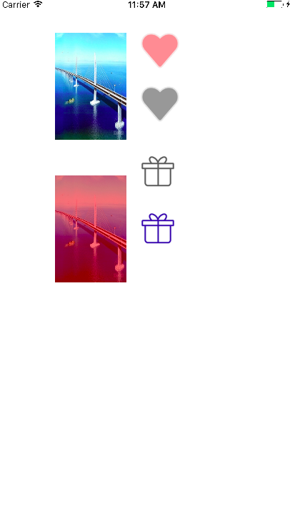

# UIImage+KYCategory

This is a Category UIImage collection, can be very convenient for the picture to dye (Tinting), increase the brightness (lightening) and reduce the brightness (darkening) and other extensions of the functional modules. 

This tutorial includes **Objective-C** and **swift** two implementation methods, will be given in the following




## How to use it in the Objective-C environment

### Installation

#### requirements

* Xcode 7 +
* iOS 7.0 +

#### installation manual

Download DEMO, sub folder **kYCategory** into the project, import the `UIImage+KYCategory.h` header file in use.

#### CocoaPods Installation

`UIImage+KYCategory` is available through [CocoaPods](https://cocoapods.org/). To install it, simply add the following line to your `Podfile`:

```
	pod 'UIImage+KYCategory'
```

####  Usage


Color a picture

```
 qiaoColorImageView.image = [[UIImage imageNamed:@"qiao"] tintedImageWithColor:[UIColor redColor] level:0.5];

```

## Use **swift** to achieve

In the `UIImage+KYCategory_swift` project to achieve a picture of the expansion, the specific implementation is as follows:

```
import UIKit

extension UIImage {


    ///  Just change a colored color image, is to change the image TintColo
    ///
    /// - Parameter tintColor: Need to change the color of the color
    /// - Returns: Returns an image
    func imageWithTintColor (tintColor: UIColor? = nil, alpha: CGFloat) -> UIImage?  {

        let rect = CGRect(x: 0.0, y: 0.0, width: self.size.width, height: self.size.height)

        UIGraphicsBeginImageContextWithOptions(rect.size,false,self.scale)

        draw(in: rect)

        let ctx = UIGraphicsGetCurrentContext()

        ctx!.setFillColor((tintColor?.cgColor)!)
        
        ctx!.setAlpha(alpha);
        
        ctx?.setBlendMode(.sourceAtop)
        
        ctx!.fill(rect);
        
        let result = UIGraphicsGetImageFromCurrentImageContext()
        
        UIGraphicsEndImageContext()
        
        return result
    }
}


```

### Usage To  swift

```
override func viewDidLoad() {
        super.viewDidLoad()
        // Do any additional setup after loading the view, typically from a nib.


        let gift01ImageView = UIImageView(image: UIImage(named: "ic-gift"))
        //设置大小
        gift01ImageView.frame =  CGRect(x: 50.0, y: 50.0, width: 48.0, height: 48.0)
        self.view!.addSubview(gift01ImageView)


        let gift02ImageView = UIImageView(image: UIImage(named: "ic-gift")?.imageWithTintColor(tintColor: UIColor.blue, alpha: 0.5))
        //设置大小
        gift02ImageView.frame =  CGRect(x: 125.0, y: 50.0, width: 48.0, height: 48.0)
        self.view!.addSubview(gift02ImageView)

    }

```

Effect as shown below:


#  Contact with feedback

>
> **weibo:** [http://weibo.com/balenn](http://weibo.com/balenn)
>
> **QQ:** 362108564
>

If there is anything you think is wrong, or have a better suggestion, the above contact can contact me. Thank you very much.

# Encourage

If it accidentally gives you help, please do not mean to give it a **star**, it is the best support for it, thank you very much! 🙏

# LICENSE

`UIImage+KYCategory` is licensed under the **MIT** protocol. Access to the **LICENSE** file for more information.


